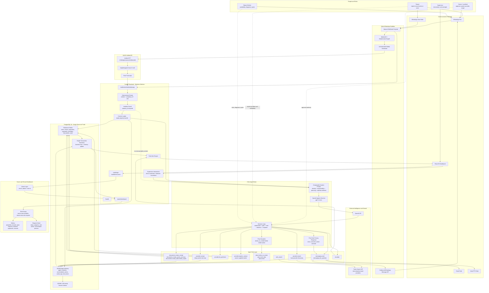

# Chris.AI

## Hackathon Technologies Used

**OpenAI** powers the agentic property-management brain. Chris uses an OpenAI
agent runtime to understand requests, plan actions, call tools, coordinate
stakeholders, and produce concise operational responses.

**Tavily** powers live provider discovery. When the owner has no preferred
repair worker or wants alternatives, Chris can search the web for relevant local
providers near the property address.

**SLNG** powers voice input. WhatsApp voice notes are downloaded from Twilio,
transcribed through the SLNG Unified STT API, and then processed by the same
agent workflow as text messages.

## Startup Pitch

Chris.AI is the autonomous operating layer for rental property management.

Property managers, landlords, and small real-estate operators spend too much
time acting as human routers: reading tenant messages, asking clarifying
questions, chasing owners for approvals, finding contractors, forwarding
availability, tracking quotes, and updating everyone manually. Every request is
small, but the coordination overhead compounds across a portfolio.

Chris.AI turns each rental unit into a managed workflow. A tenant can report a
problem by text or voice. Chris qualifies the issue, checks property context,
creates a plan, summarizes the situation for the owner, asks for the right
approval, finds or contacts a repair worker, coordinates time slots, tracks
progress, and updates the dashboard. The owner keeps decision authority. The
tenant gets visibility. The worker receives only the operational details needed
to solve the problem.

The core product idea is simple: one property, one logical Chris agent, one
isolated context. The agent is smart enough to move work forward, but the
platform is deterministic where it matters: routing, persistence, isolation,
audit trails, tool execution, and dashboard visibility.

For the demo, Chris.AI shows a full three-party loop:

- Tenant reports a repair issue through WhatsApp text or voice.
- Chris creates a request plan and sends a structured summary to the owner.
- Owner approves, rejects, or supplies a preferred worker.
- Chris brings the worker into the loop and coordinates availability.
- Dashboard shows portfolio state, tenant requests, progress, and owner actions.

## What Is Implemented

- FastAPI backend with stateless workers and health endpoints.
- PostgreSQL schema with relational business facts and JSONB agent memory.
- React/Vite BI dashboard with demo login for landlords and tenants.
- Role-scoped access: owners see all tenant requests for their properties;
  tenants see only their own request progress.
- Context-injected Chris agent using OpenAI, plan discipline, and tool calls.
- Tavily-backed provider search for local repair-worker discovery.
- Twilio WhatsApp Sandbox integration for inbound/outbound text messages.
- SLNG Unified STT integration for WhatsApp voice-note transcription.
- Provider registration/contact flow for owner-supplied third-party workers.
- Tool tracing, conversations, action logs, active plans, and dashboard metrics.
- Prompt evaluation harness covering responsibility, planning, document
  integrity, injection defense, and property isolation.

## Run Locally

Create a local environment file:

```bash
cp .env.example .env
```

Fill the placeholders in `.env`, especially:

```bash
OPENAI_API_KEY=...
TAVILY_API_KEY=...
SLNG_API_KEY=...
TWILIO_ACCOUNT_SID=...
TWILIO_AUTH_TOKEN=...
WHATSAPP_MODE=twilio
APP_AGENT_RUNTIME=llm
```

Start the stack:

```bash
make up
```

Run migrations and seed the baseline demo:

```bash
make migrate
make seed
```

Run prompt evals:

```bash
make eval
```

Services:

- Backend API: http://localhost:8000
- API health: http://localhost:8000/health
- Frontend dashboard: http://localhost:5173
- Adminer: http://localhost:8082
- Twilio webhook: `https://<ngrok-domain>/webhooks/twilio/whatsapp`

Demo login accounts:

- Owner: `hamza.landlord@example.com`
- Tenant: `amina.tenant@example.com`

## Manual Demo Flow

1. The tenant sends a WhatsApp text or voice note:

   ```text
   Hi Chris, I have a leak under the kitchen sink. Water runs when I open the
   tap, and I put a bucket underneath. I am available tomorrow morning or Friday
   afternoon.
   ```

2. Chris transcribes the voice note if needed, creates a plan, and sends the
   owner a structured summary.

3. The owner replies with a preferred worker:

   ```text
   Contact Karim at +33XXXXXXXXX. You can organize a visit, but ask me for
   approval if the quote is above 180 euros.
   ```

4. Chris registers the worker, contacts them, coordinates availability, and
   keeps tenant and owner updated.

5. The owner dashboard shows request status, plan progress, recent actions, and
   open approvals.

## Repository Map

- `backend/app/agent/`: Chris agent loop, prompts, tools, providers.
- `backend/app/api/`: FastAPI routes for auth, dashboard, webhooks.
- `backend/app/orchestration/`: deterministic routing, alerts, intervention,
  isolation.
- `backend/app/domain/`: SQLAlchemy models, schemas, repositories.
- `backend/tests/prompt_evals/`: prompt-evaluation harness and scenarios.
- `frontend/`: React/Vite landlord and tenant dashboard.
- `docs/`: architecture, agent rules, tool contracts, security, setup guides.

## Documentation

- [Overview](docs/01-overview.md)
- [Architecture](docs/02-architecture.md)
- [Single Agent](docs/03-single-agent.md)
- [Orchestration Layer](docs/04-orchestration-layer.md)
- [Data Model](docs/05-data-model.md)
- [Prompt Engineering](docs/06-prompt-engineering.md)
- [Tool Contracts](docs/07-tool-contracts.md)
- [Evaluation Strategy](docs/08-evaluation-strategy.md)
- [Local Development](docs/09-local-development.md)
- [Security and Isolation](docs/10-security-and-isolation.md)
- [WhatsApp Cloud API Setup](docs/11-whatsapp-cloud-setup.md)
- [Twilio WhatsApp Sandbox Setup](docs/12-twilio-sandbox-setup.md)

## Technical Summary

- `POST /webhooks/twilio/whatsapp`: receives WhatsApp events from Twilio.
- Twilio media flow: `MediaUrl0` is downloaded with Twilio credentials.
- SLNG STT flow: WhatsApp `audio/ogg` is sent to
  `/v1/bridges/unmute/stt/slng/deepgram/nova:3-multi` with `encoding=opus`.
- Router flow: sender phone/email resolves to `property_id` and sender role.
- Context flow: backend loads exactly one property context from PostgreSQL.
- Agent flow: Chris reviews or creates a plan before externally visible action.
- Tool flow: messaging, provider search/contact, documents, escalation, web
  search, and plan tools are executed with `property_id` injected by the system.
- Memory flow: conversations, plans, tool traces, and action logs are persisted
  in PostgreSQL JSONB tables.
- Dashboard flow: React calls `/api/auth/login` and `/api/portal/dashboard`
  through the Vite proxy.

## Technical Highlight


