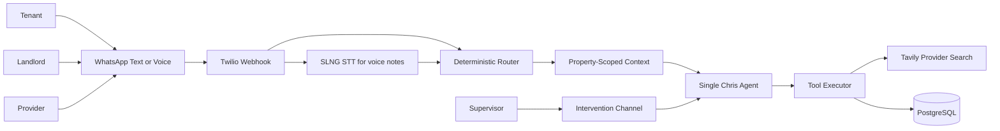

# Overview

Chris.AI is an autonomous AI property management platform for rental portfolios.
It helps manage tenant requests, landlord approvals, provider coordination, rent
receipts, lease lifecycle events, and document production.

The product has two layers:

- Single Chris agent: one logical agent scoped to one property.
- Orchestration layer: deterministic routing, context loading, state tracking,
  alerts, and human intervention hooks for the whole fleet.

The first build focuses on the single-agent prompt system and a runnable project
skeleton, with enough real integrations to demonstrate the end-to-end operating
loop. OpenAI powers the agent brain, Tavily powers provider discovery, Twilio
handles WhatsApp transport, and SLNG transcribes inbound WhatsApp voice notes.
Email and outbound voice remain stubbed for local development.

## Core Principles

Agents do the thinking. They interpret messages, maintain plans, decide the next
allowed action, communicate with humans, and produce controlled documents.

Orchestration does the plumbing. It resolves senders, loads context, enforces
property scope, persists state, executes alerts, and exposes supervisor controls.

One property means one logical Chris. There is one FastAPI deployment and one
agent class. The API injects exactly one property's context per turn.

## Read Next

- [Architecture](02-architecture.md)
- [Single Agent](03-single-agent.md)
- [Security and Isolation](10-security-and-isolation.md)
