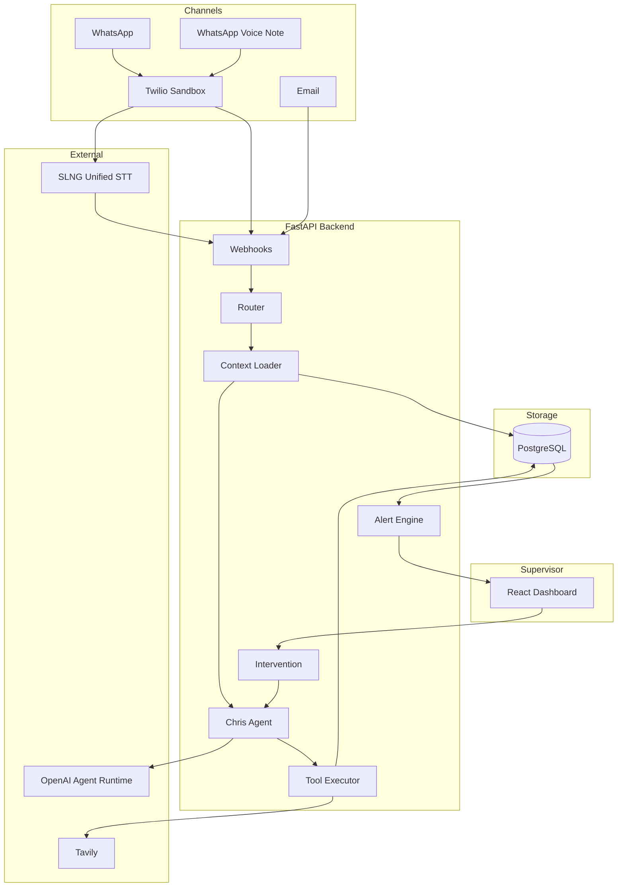
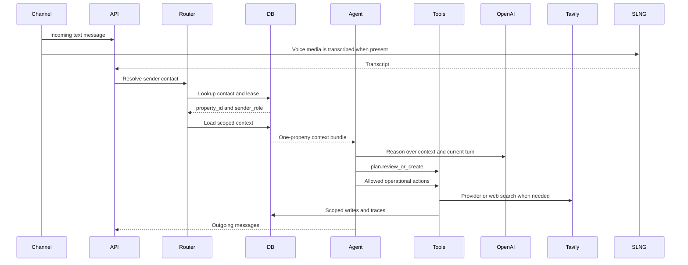

# Architecture

Chris.AI uses stateless FastAPI workers, a context-injected agent, and a single
PostgreSQL database for both relational business data and JSONB agent memory.

## Per-Turn Flow

FastAPI workers keep no critical state in memory. Any worker can serve any turn
because PostgreSQL is the source of truth for both business facts and agent
memory.

## Provider Abstraction

Agent code depends on `LLMProvider`, not directly on any SDK. OpenAI is the
default provider. Anthropic is wired as a stub so provider selection is a config
change once implemented.

## Hackathon Integrations

- OpenAI: agentic reasoning and response generation through the provider
  abstraction and the OpenAI agent runtime.
- Tavily: live web search for provider discovery near the scoped property
  address.
- SLNG: speech-to-text for WhatsApp voice notes using the Unified STT endpoint
  before routing the transcript through the normal agent flow.

## Read Next

- [Single Agent](03-single-agent.md)
- [Data Model](05-data-model.md)
- [Tool Contracts](07-tool-contracts.md)
