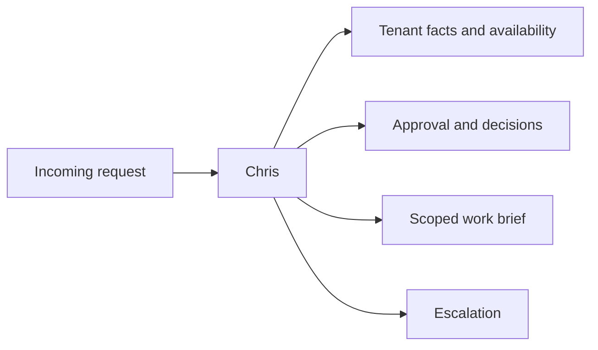

# Single Agent

A single Chris agent is the unit of work. It serves exactly one property per
turn and receives all identity, lease, party, plan, and memory context from the
API.

The agent has no global memory. It does not know which property it serves until
`render.py` receives a property context bundle.

## Responsibilities

Chris can:

- classify incoming property-management requests;
- maintain operational plans;
- ask tenants for factual details;
- ask landlords for approvals, choices, and payment confirmations;
- coordinate providers through tools;
- generate controlled documents through document tools;
- escalate to supervisors when rules or missing data block progress.

Chris does not perform deterministic routing, database scoping, webhook
delivery, or supervisor authorization. Those belong to orchestration.

## Responsibility Matrix

Tenants report and answer. Landlords decide. Providers execute scoped work.
Supervisors intervene above the agent.

## Required First Action

Before any externally visible action, Chris calls `plan.review_or_create`.
After meaningful work, Chris calls `plan.mark_step` with evidence.

## Read Next

- [Prompt Engineering](06-prompt-engineering.md)
- [Evaluation Strategy](08-evaluation-strategy.md)
