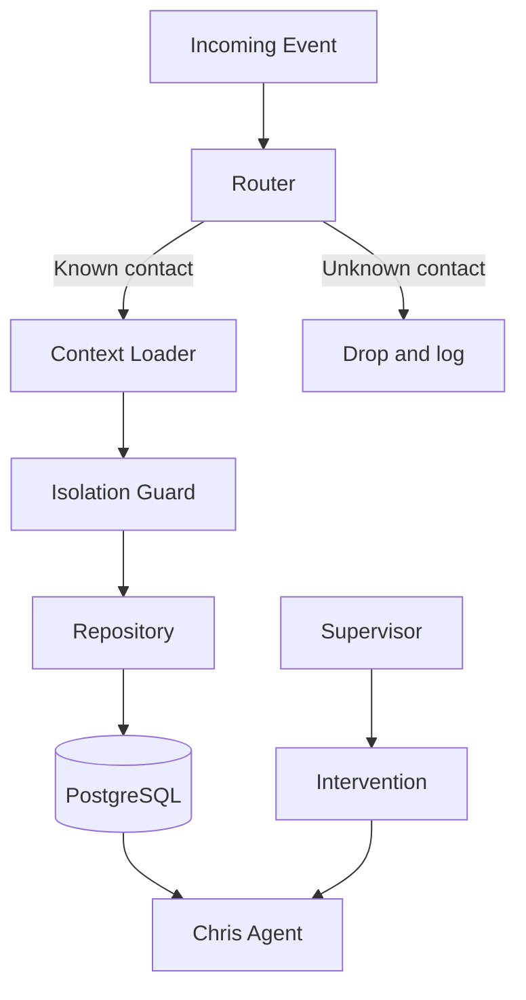

# Orchestration Layer

The orchestration layer is deterministic. It provides routing, context loading,
state persistence, alerts, and intervention hooks.

It does not make fuzzy business judgments. Those are delegated to Chris inside
the allowed rule boundaries.

## Components

Router: resolves `(property_id, sender_role)` from an incoming sender contact.
Unknown contacts are logged and dropped.

Isolation guard: every scoped repository call passes through `scoped(property_id)`.
Missing property scope is rejected, and tests assert this behavior.

Alert engine: pure rules over state. V1 includes landlord-no-response,
workflow-no-progress, rent-overdue, quote-pending, provider-job-pending,
agent-stuck-flag, tenant-distress-flag, maintenance-date-approaching, and
legal-document-produced.

Intervention: supervisor endpoints for direct instruction, takeover, and forced
escalation.

## Read Next

- [Architecture](02-architecture.md)
- [Security and Isolation](10-security-and-isolation.md)
