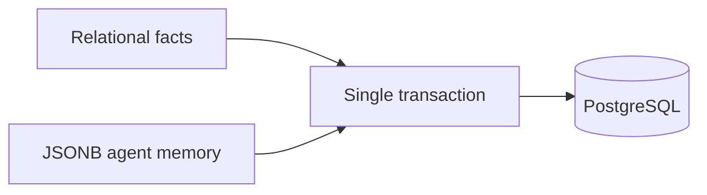

# Data Model

Chris.AI uses one PostgreSQL database for relational business data and JSONB
agent memory. This keeps business updates and memory updates in the same
transaction.

## Relational Tables

- `organizations`: supervisor entities.
- `users`: supervisors, landlords, and tenants.
- `properties`: rental units with equipment and access JSONB fields.
- `leases`: rent, charges, dates, tenant, and landlord.
- `payments`: period payments and landlord confirmation state.
- `providers`: service providers and contacts.
- `property_preferred_providers`: ranked provider preferences per property.
- `documents`: controlled document records.
- `audit_log`: immutable state-changing actions.

## JSONB Memory Tables

- `agent_contexts`: narrative memory and sensitive notes per property.
- `conversations`: append-only message arrays per party and thread.
- `plans`: active and completed operational plans.
- `action_log`: what the agent already did.
- `tool_traces`: every tool call input, output, and duration.

Every JSONB-backed table has `property_id` as a non-null foreign key. Repository
methods take `property_id` explicitly.

## Document Boundary

Legal facts in documents come from relational tables only. Message text is never
an authoritative source for names, amounts, addresses, or dates.

## Read Next

- [Tool Contracts](07-tool-contracts.md)
- [Security and Isolation](10-security-and-isolation.md)
