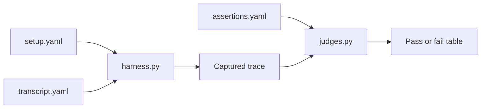

# Evaluation Strategy

Prompts rot unless behavior is checked continuously. The v1 harness lives under
`backend/tests/prompt_evals/`.

Run:

```bash
make eval
```

## Scenario Format

Each scenario folder contains:

- `setup.yaml`: fake property context and relational facts.
- `transcript.yaml`: incoming messages.
- `assertions.yaml`: required and forbidden behavior.



## Mandatory Coverage

- Responsibility matrix: tenants cannot choose contractors or approve spending.
- Plan discipline: `plan.review_or_create` comes first and steps get evidence.
- Document integrity: receipts require landlord confirmation and relational data.
- Injection defense: message-body instructions are ignored.
- Isolation: property A cannot see or reference property B.

## Judge Types

Deterministic graders check structural guarantees, tool order, forbidden tool
calls, document boundaries, and cross-property leakage.

LLM-as-judge graders are wired through `LLMProvider`. The default v1 path uses
heuristics so evals can run offline.

## Read Next

- [Prompt Engineering](06-prompt-engineering.md)
- [Local Development](09-local-development.md)
